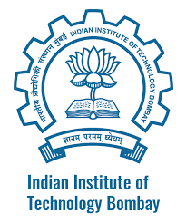
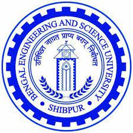

## Profile Summary

Ph.D. from IIT Bombay with formal models (Petri net) in focus. Equally skilled in hands-on coding from six years of extensive industry experience on building various distributed systems in data-management domain. My research interests broadly lie in the area of query processing and optimization aspects of data management systems. I am also experienced and equally interested in concurrent programming models, model driven engineering, architectural refactoring, and formulating distributed algorithms. Further, I always look forward to work out theoretically elegant solutions for
practical problems, thus, materializing fundamentals into systems research.

<table>
  <tbody>
    <tr>
      <td align="center"><h2>Work Experience</h2></td>
      <td align="center" colspan="2"><h2>Education</h2></td>
    </tr> 
    <tr>
      <td align="center"></td>
      <td align="center"></td>
      <td align="center"></td>
    </tr>
      <tr style="width:200px">
        <td align="center"><pre>System Architect/Research Scientist: 2017 (Mar) - 2023 (Apr)</pre></td>
      <td align="center"><pre>M.Tech.+Ph.D. (Dual Degree) (CS): 2011 - 2016 (Dec)</pre></td>
      <td align="center"><pre>B.E. (CS): 2007 - 2011</pre></td>
    </tr>
  </tbody>
</table>
