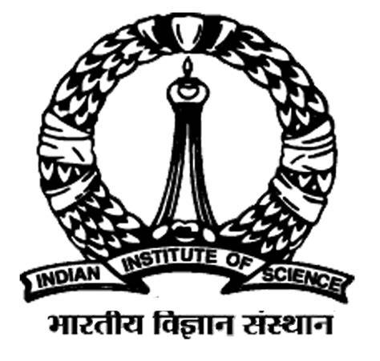
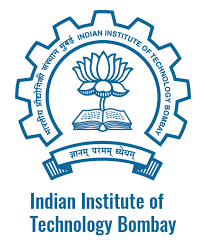
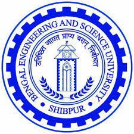

## Profile Summary
Assistant Professor, CSE, 
<a href="https://www.iiitb.ac.in/" target="_blank"  rel="noopener noreferrer">International Institute of Information Technology Bangalore</a>.

Currently teaching databases to undergrad students.

Got industrial exposure to the database domain while in 
<a href="https://www.huawei.com/in/" target="_blank"  rel="noopener noreferrer">Huawei India</a>, 
which motivated me to pursue postdoctoral research in the domain at 
<a href="https://cds.iisc.ac.in/" target="_blank"  rel="noopener noreferrer">CDS, IISc</a>, 
with <a href="https://dsl.cds.iisc.ac.in/~haritsa/" target="_blank"  rel="noopener noreferrer">Prof. Jayant Haritsa</a>.

Prior to that, completed M.Tech.+Ph.D. dual degree from 
<a href="https://www.iitb.ac.in/" target="_blank"  rel="noopener noreferrer">IIT Bombay</a>, 
under the guidance of 
<a href="https://www.cse.iitb.ac.in/~rkj/" target="_blank"  rel="noopener noreferrer">Prof. R. K. Joshi</a>. 

My UG degree in CS is from 
<a href="https://www.iiests.ac.in/" target="_blank"  rel="noopener noreferrer">BESU (IIEST Shibpur)</a>.

Broadly, equally interested in theory and system-building work.

<strong>Teaching</strong>

<ul>
  <li>EGC 211P: Introduction to Object Oriented Design Principles (C++) — Autumn 2025–26</li>
  <li>DAS 101: Introduction to Database Systems — Spring 2025–26</li>
  <li>CS 705: Advanced Topics in Databases — Autumn 2026–27</li>
  <li>
    Co-instructor:
    <a href="https://dsl.cds.iisc.ac.in/~course/TIDS/TIDS.html" target="_blank" rel="noopener noreferrer">
      Topics in Database Systems (E0 361)
    </a> (Jan 2025)
  </li>
</ul>

<table>
  <tbody>
    <tr>
      <td align="center" colspan="2"><h2>Experience</h2></td>
      <td align="center" colspan="2"><h2>Education</h2></td>
    </tr> 

    <tr>
      <!-- IISc CDS -->
      <td align="center">
        
      </td>

      <!-- Huawei -->
      <td align="center">
        
      </td>

      <!-- IIT Bombay -->
      <td align="center">
        
      </td>

      <!-- IIEST Shibpur -->
      <td align="center">
        
      </td>
    </tr>

    <tr>
      <td align="center">
        Postdoctoral 
        Research Associate/Fellow: 
        2023 (May) - 2025 (June)
      </td>

      <td align="center">
        System Architect / 
        Research Scientist: 
        2017 (Mar) - 2023 (Apr)
      </td>

      <td align="center">
        M.Tech.+Ph.D. 
        (Dual Degree) (CS): 
        2011 - 2016 (Dec)
      </td>

      <td align="center">
        B.E. (CS): 
        2007 - 2011
      </td>
    </tr>
  </tbody>
</table>

  
